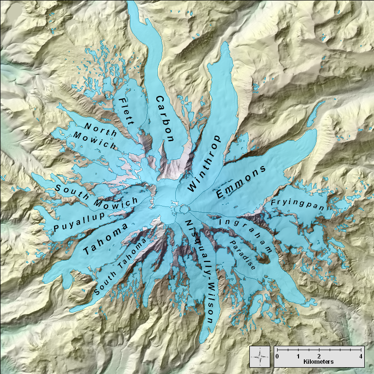

- [Installation](#installation)
- [Usage](#usage)
- [Contributing](#contributing)
- [License](#license)


# Surface Event Detection

This repository contains notebooks that show how to use my trained ML model to detect surface events (Avalanches/Rockfalls/Debris Flows) through continuous seismograms from multiple stations. 
The model was trained on over 200k seismic events in the Pacific northwest. [Ni et al. 2023](https://seismica.library.mcgill.ca/article/view/368/868). 
For more information about the model training and tuning, please check out this [github repository](https://github.com/Akashkharita/PNW_seismic_event_classification_ML/tree/main)
The model classifies a 150s window with a user-defined stride and outputs a class and probabilities associated with each class for each window. It is trained to classify the data into four classes - 1. Earthquake, 2. Explosions, 3. Noise and 4. Surface Events. 


Following figure shows different glaciers in Mount Rainier that hosts a variety of surface events on which our model was trained. 




## Installation

Instructions on how to install...

First we will clone the repository by going to the terminal and typing

```
git clone https://github.com/Akashkharita/Surface_Event_Detection.git

```


Then we will enter the repository by

```
cd Surface_Event_Detection
```


Second, let's setup a conda environment using the following command. 

```
conda create -n surface python=3.9.5
```

Activate the environment

```

conda activate surface
```

Then we will install the required dependencies 
```
pip install -r requirements.txt
```

Then we will add the conda environment to jupyter hub 
```
conda install ipykernel
```
```
python -m ipykernel install --user --name=surface
```


Now we are all set to go! 😃

## Usage
The [notebook](Notebooks/Automated_Surface_Event_Detection.ipynb) shows an example of how to detect surface events through continuous seismograms and visualize the results with detailed documentation. I showed the entire process by using three examples of verified surface events (one example each of avalanche, fall and flows). The users are free to run the model on the timing and stations of their choice. 


## Contributing
Anyone is welcome to contribute to improve the codes and visualization of the results. I am available at my email  - ak287@uw.edu for further collaboration. 

## License

The repository has an MIT License. 
